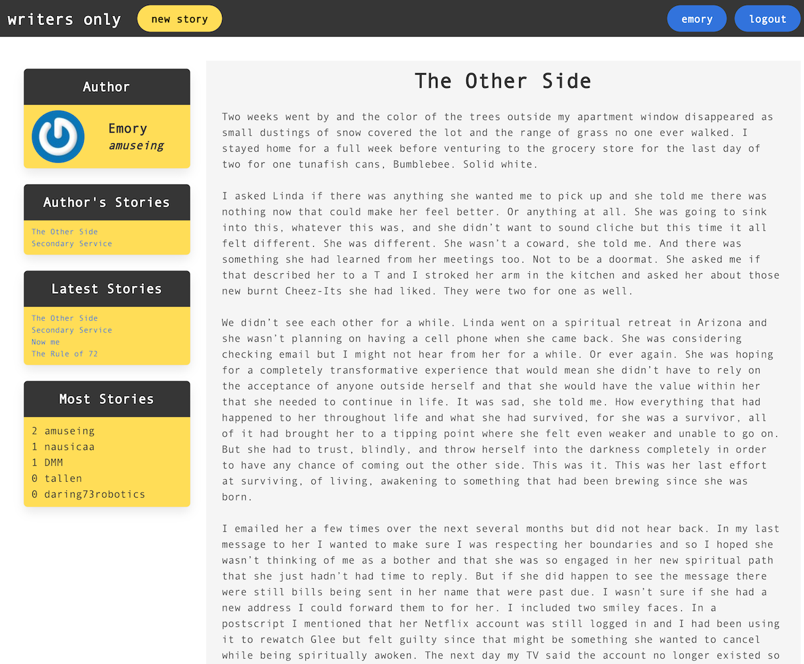
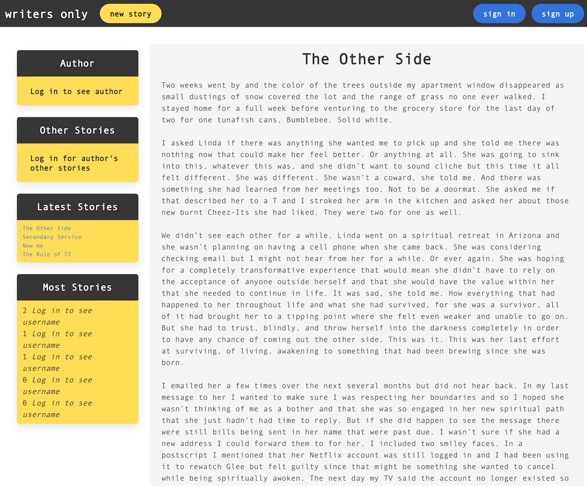

# Writers Only (Members Only)

## Quick Take

In this app, Writers Only, anyone can view the stories that have been posted, but only logged in members can see the author names and view profiles.

This app is based on the Members Only authentication project from The Odin Project's Rails curriculum. The project focuses on the use of the Devise ruby gem in order to implement authentication for users. You can learn more about the assignment [here](https://www.theodinproject.com/paths/full-stack-ruby-on-rails/courses/ruby-on-rails/lessons/members-only#project-members-only).

## How it Works

Once registered and logged in, a user gains access to author names and the Most Stories display. Users must also have an account and be logged in before they can post a new story.

This Rails app uses two models, User (`has_many` association) and Story (`belongs_to` association). 

Devise handles the heavy lifting for the User model and the authentication. Devise hashes and stores a password for authenticity. It also includes OmniAuth support, handles password resets, registration, token generation for saved cookies, and more. 

## Design

The app was built using the Bulma CSS framework. You can see the differences between the app when logged in and logged out.





## Demo Online

Check out a live preview deployed to Heroku. It might take a few to wake from sleep: https://whispering-spire-62153.herokuapp.com/

## Try It Local

* Ruby version 2.7.2
* Rails version 6.1.4

```ruby
$ git clone git@github.com:dm-murphy/members-only.git
$ bundle install
$ rails db:migrate
```

## What Was Learned

This project showed me how much simpler Device makes the user model process in Rails. Not only does this gem give confidence in handling authentication but it includes some basic forms to handle everything from registration to sign-ins. It is a handy time saver.

This was my first experience using Bulma for CSS. I found it quick and the style choices were good but a bit limiting. I can see the value in using a framework for CSS but it also prevents a lot of customization that I am used to with vanilla CSS. Useful in a test app or quick MVP.

I most appreciated learning just how many levels there are to a web app based on the user's status. Proper measures need to be taken to prevent data from being seen by unregistered users and this can effect the style and design of the whole page.